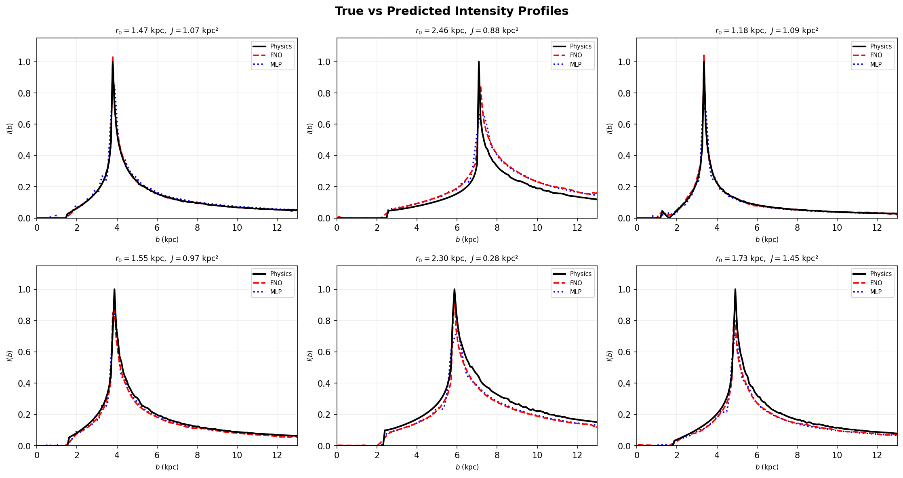
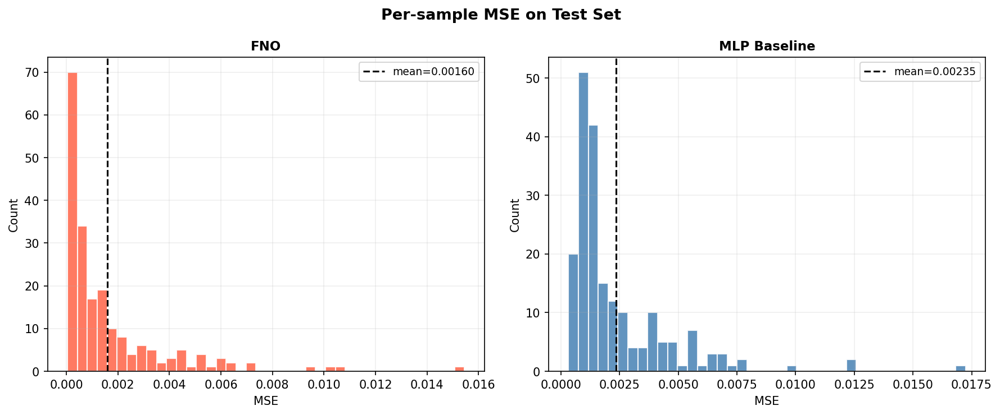
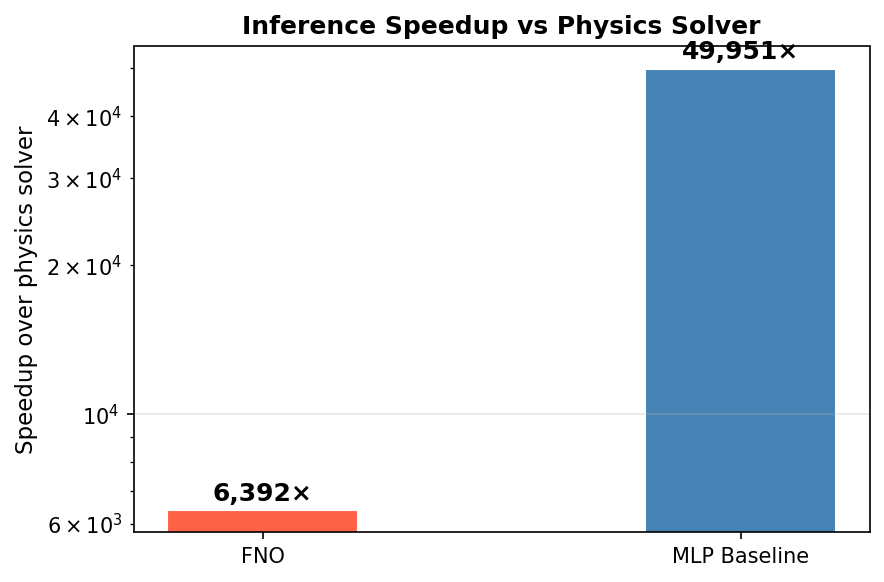

# lensing-fno-surrogate

A PyTorch surrogate model that replaces an expensive ray-tracing ODE solver for a slowly rotating NFW wormhole. A **Fourier Neural Operator (FNO)** learns the mapping from physical parameters to the gravitational lensing intensity profile.

> **r₀, J** → **I(b)**  (6,392× faster than the physics solver)

---

## Results

### True vs Predicted Intensity Profiles



Each panel shows one test sample. Black = physics solver ground truth, red dashed = FNO, blue dotted = MLP baseline.

---

### Per-sample MSE Distribution (Test Set)



---

### Inference Speedup vs Physics Solver



---

### Metrics

| Metric | FNO | MLP Baseline |
|---|---|---|
| Test MSE | **0.001600** | 0.002354 |
| Test MAE | **0.02135** | 0.02386 |
| Relative L2 | **18.5%** | 24.4% |
| Inference time | 0.225 ms/sample | 0.029 ms/sample |
| Speedup vs solver | **6,392×** | 49,951× |

FNO is 32% more accurate than the MLP. MLP is faster at inference but can't generalise to non-uniform grids.
Physics solver average: **1,437 ms/sample**.

---

## Physics

The solver integrates null geodesics for a rotating NFW wormhole:

- **Φ(r)** — NFW gravitational potential
- **b(r, r₀)** — wormhole shape function with throat at r₀
- **ω(r, J) = 2J/r³** — frame-dragging from angular momentum J

The intensity I(b) is computed by integrating an accretion-disc emissivity along the photon path. A photon sphere exists at radius r_ph where d(r·e^{−Φ})/dr = 0; rays with b < b_ph are captured.

**Fixed parameters:** Rₛ = 1.447 kpc, ρₛ = 3.11×10⁻³ kpc⁻², r_obs = 50 kpc
**Swept parameters:** r₀ ∈ [0.3, 2.5] kpc, J ∈ [0.0, 1.5] kpc²

---

## Model

### Fourier Neural Operator (FNO1d)

Input at each b-grid point: `[r₀_norm, J_norm, b_norm]` → shape `(B, N, 3)`

```
fc0  (3 → 32)
  ↓
4 × FNOBlock
    SpectralConv1d (truncated FFT, modes=24) + pointwise Conv1d + GELU
  ↓
fc1  (32 → 128) + GELU
fc2  (128 → 1)  → (B, N)
```

~205K parameters. InstanceNorm omitted — it collapses sparse intensity profiles to near-zero.

### MLP Baseline

```
Linear(2 → 512) → [LayerNorm → Linear → GELU] × 3 → Linear(512 → 150)
```

~870K parameters. Direct parameter-to-profile mapping.

---

## Quick Start

```bash
pip install -r requirements.txt

# 1. Generate dataset (2000 samples, 4 workers)
python main.py --mode generate --n_samples 2000

# 2. Train FNO
python main.py --mode train_fno --epochs 200 --modes 24 --width 32 --lr 5e-4

# 3. Train MLP baseline
python main.py --mode train_baseline --epochs 200

# 4. Evaluate + plots
python main.py --mode evaluate
```

---

## Project Structure

```
lensing_operator/
├── main.py
├── requirements.txt
├── physics/ray_tracing.py        ← NFW wormhole ODE solver
├── data/
│   ├── generate_dataset.py       ← parallel dataset generation
│   └── dataset_loader.py         ← PyTorch Dataset + DataLoader
├── models/
│   ├── fno.py                    ← FNO1d
│   └── cnn_baseline.py           ← MLP baseline
├── training/
│   ├── train_fno.py
│   └── train_baseline.py
├── evaluation/
│   ├── metrics.py
│   └── compare_models.py
└── plots/                        ← saved figures
```

---

## Dataset

| File | Shape | Contents |
|---|---|---|
| `data/params.npy` | `(N, 2)` | `[r₀, J]` per sample |
| `data/profiles.npy` | `(N, 150)` | normalised I(b) |
| `data/b_grid.npy` | `(150,)` | impact-parameter grid [0.05, 13.0] kpc |
| `data/solver_time.npy` | `(1,)` | mean solver wall time (s) |

Dataset files are excluded from git (too large). Re-generate locally with `--mode generate`.
